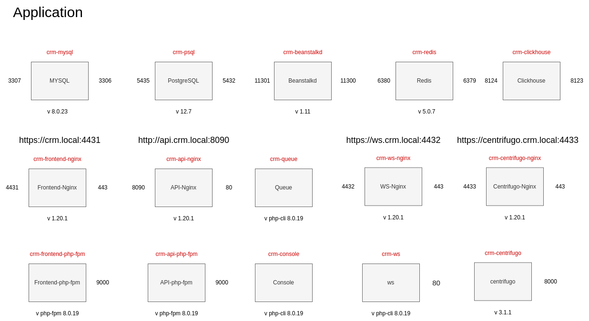
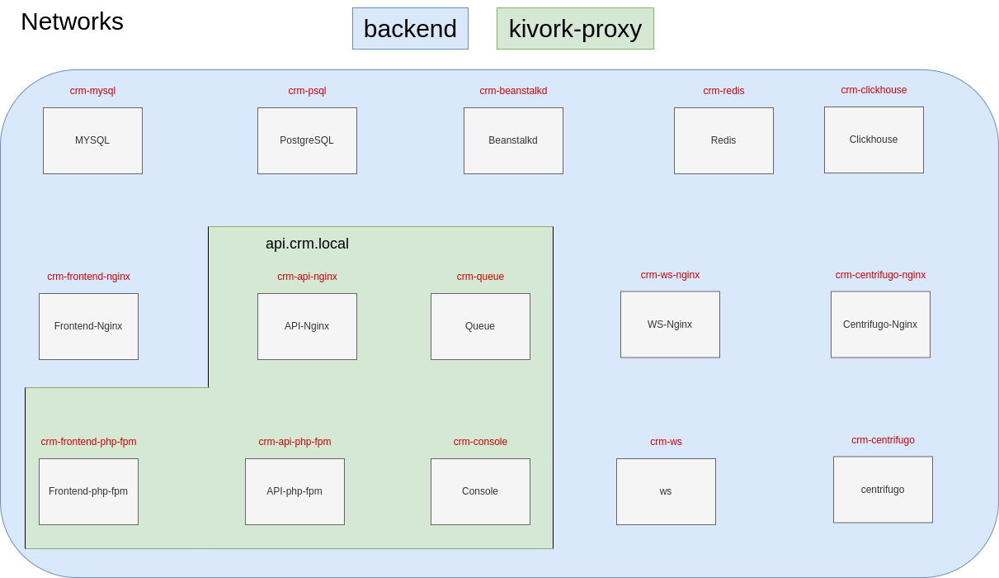

#DOCKER
#### Run local version (OS Linux)
```!!! Your id_rsa.pub have to be set in bitbucket.org -> Personal settings > SSH keys```
___________________
### Install application

####If you did not install Docker, Docker Compose or you have a permission problem you must execute a command ```./server.sh docker-install```

1 Register domain in /etc/host  ```127.0.0.1 crm.local``` ```127.0.0.1 api.crm.local``` ```127.0.0.1 ws.crm.local``` ```127.0.0.1 centrifugo.crm.local``` 

2 sudo chmod +x server.sh

3 It is necessary to put a backup of the MySql DB in ``.docker/mysql/dump/dump.sql`` or ``.docker/mysql/dump/dump.gz``

4 It is necessary to put a backup of the PostgreSql DB in ``.docker/psql/dump/dump.sql``

5 ./server.sh init-env

6 Open file .docker/.env and check valid path SSH_KEY, SSH_KEY_PUB and other variables

7 Open file .env and check valid variables

8 ./server.sh application-install

9 ./server.sh cert-install or ./server.sh cert-update

10 copy all files console/migrations/archive/2022 to console/migrations

11 ./server.sh start

12 Open the url https://crm.local:4431/ in your browser

13 remove all copied files from 10 menu item from console/migrations

### Notes
10 and 13 menu items it is temporally items

### Tools

#### 1 Yii commands

1.1 ./server.sh yii param1 param2 ...

1.2 Ex.: ./server.sh yii migrate/create test

#### 2 Composer commands

2.1 ./server.sh composer param1

2.2 Ex.: ./server.sh composer install

#### 3 Npm commands

3.1 ./server.sh npm param1

3.2 Ex.: ./server.sh npm install

#### 4 In order to run console app

4.1 ./server.sh app-console

#### 5 In order to install valid certificate for browser, do the following

5.1 ./server.sh install-cert

5.2 ./server.sh update-cert

#### 6 In order to enable local back office

6.1 set USE_LOCAL_BO=true to .env

6.2 set nginx container name back office to .env Ex.: NGINX_CONTAINER_LOCAL_BO=nginx-bo

6.3 ./server.sh init-local-bo

#### 7 Schema

<p align="center">





</p>