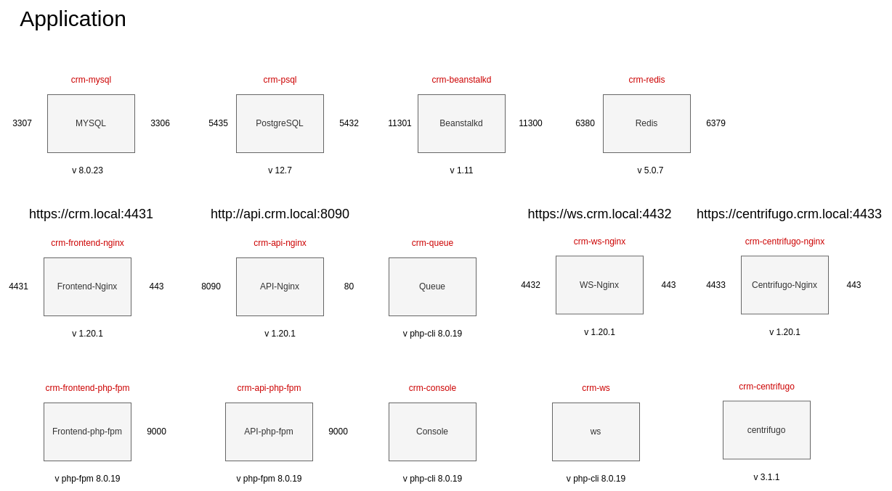

CRM: Infrastructure as Code
-------------------------------------------

CRM application is written on PHP 7.4 and uses Yii 2.0 framework underneath.
It allows us to manage company's customers interactions.

CRM application exposes 4 entry-points:
- App that provides user-interface
- API for internal and external services
- Websocket connection for instant messaging
- Websocket connection for system notifications

Logically you can split CRM architecture into the following layers
- Application layer consist of Ubuntu servers that run Nginx, php-fpm and supervisord
- Websockets servers are implemented using swoole and centrifugo
- Caching layer is handled by Redis
- Queue layer is managed by Beanstalk
- Persistent data layer consists of RDS MySQL, PostgreSQL and S3

>**Base Image:**

`crm-frontend-nginx`: nginx:1.20.1

`crm-api-nginx`: nginx:1.20.1

`crm-ws-nginx`: nginx:1.20.1

`crm-frontend-php-fpm`: php:8.0.19-fpm

`crm-api-php-fpm`: php:8.0.19-fpm

`crm-ws`: php:8.0.19-cli

`crm-queue`: php:8.0.19-cli

`crm-centrifugo-nginx`: nginx:1.20.1

`crm-centrifugo`: centrifugo/centrifugo:v3.1.1

`crm-psql`: postgres:12.7

`crm-mysql`: mysql:8.0.23

`crm-redis`: redis:5.0.7

`crm-beanstalkd`: ubuntu:20.04

`console:` php:8.0-cli

>**Software stack:**

`Language:` PHP 8.0

`Framework:` Yii2

`DB:` MySQL 8, PostgreSQL 12.7

`OS:` Ubuntu 20.04

`Queue:` Beanstalk

`Websockets:` Swoole, Centrifugo

`Cache, session:` Redis

>**Exposed ports:**

`crm-frontend-nginx`: 4431->443

`crm-api-nginx`: 8090->80

`crm-ws-nginx`: 4432->443

`crm-frontend-php-fpm`: 9000

`crm-api-php-fpm`: 9000

`crm-ws`: 

`crm-queue`:

`crm-centrifugo-nginx`: 4433->443

`crm-centrifugo`: 

`crm-psql`: 5435->5432

`crm-mysql`: 3307->3306

`crm-redis`: 6380->6379

`crm-beanstalkd`: 11301->11300

`console:`

# [Terraform](terraform/dev/README.md)
In this directory, you will find manifests that describe AWS infrastructure.

# [Ansible](ansible/README.md)
This directory contains playbooks that are used in server provisioning and application deployment.

# [Jenkins](jenkins/README.md)
Jenkins dir contains CI/CD pipelines that interact with ansible playbooks.

# [Bash](bash/README.md)
This directory contains handy script that can assist you with env migration.

Contact Us
==========

For more information please contact: [devops@techork.com](mailto:devops@techork.com).
You can also join our [channel](https://chat.travel-dev.com/devoffice/channels/devops).
