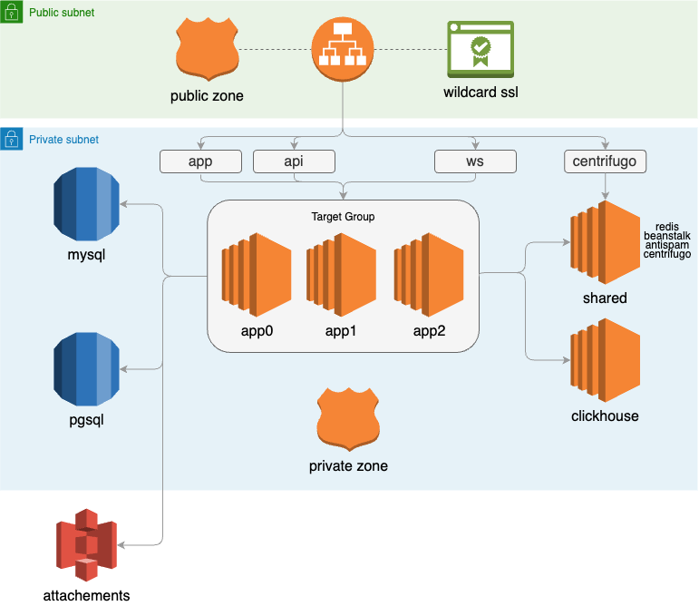

CRM: Terraform
-------------------------------------------




### Prerequisite ###

* AWS Account with admin privileges
* Route53 Hosted Zone
* Linux environment to run the code
* Terraform v1.1.6
* SOPS v3.7.2

### Infrastructure deployment

##### 1. Configure AWS access profile
```
aws configure --profile aws-dev-infra
```

##### 2. Decrypt terraform variable file with sops

````
export SOPS_AGE_KEY_FILE="$HOME/.sops/aws-dev-age"
export SOPS_AGE_RECIPIENTS="age13svya8dz2uwhw4j8qy93hvyc3q7u03y2xqj5fgda7uc89gmsvcqqh62nf0"
sops -d enc.variables > variables.tf
```

##### 3. Initialize terraform

```
terraform init
```

##### 4. Review terraform plan

```
terraform plan
```

##### 5. Apply the plan and save the output

```
terraform apply
```

##### 6. Generate keys for s3 bucket

```
aws iam create-access-key \
    --user-name attachments-crm-dev1 \
    --profile aws-dev1-infra
```